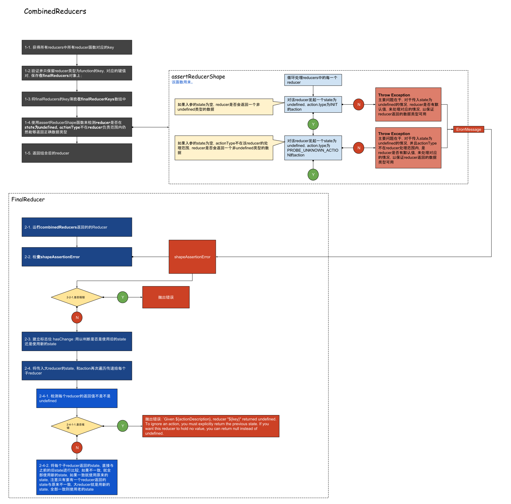

## 流程

combinedReducers的功能是将reducers对象（一个与state，结构相同的，但每个节点都是reducer函数的对象），组合成一个reducer的函数，使用该函数可以然后对应的actionType找到对应的reducer进行处理，最后这整个reducer返回一个新的state;

### combinedReducer最佳实践
> ⚠️ 不论怎样，例如actionType找不到，传入的state为undefined，返回值都必须不能为undefined, 甚至于null都可以被允许返回，唯有undefined不行；

> ⚠️ 虽然默认的actionType中INIT和PROBE_UNKNOWN_ACTION$用于检查返回state的合法性，但是并不意味着reducer需要对这两个action类型进行处理，无视即可；

> ⚠️ 请注意，reducer一定要保持pure，否则combinedReducer返回的大Reducer将无法判断，在state是object时，state是否已经被改变
